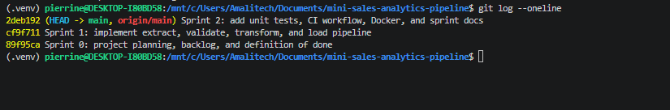

# Sales Analytics Pipeline

## Project Overview

A lightweight ETL pipeline that reads raw sales CSV data, validates it, transforms it into clean outputs, and generates a product summary. Built and delivered across two Agile sprints with full CI/CD, automated testing, and Docker support.

## Technologies Used

* Python 3.12
* Git and GitHub
* GitHub Actions
* Pytest 9.0.3
* Docker

## How to Run

```bash
python3 -m venv .venv
source .venv/bin/activate
pip install -r requirements.txt
python pipeline.py
```

## How to Run Tests

```bash
pytest tests/ -v
```

## Docker

```bash
docker build -t sales-pipeline .
docker run --rm sales-pipeline
```


## Version Control

The project was developed incrementally using Git with one commit per sprint deliverable.




## Project Structure

```text
mini-sales-analytics-pipeline/
├── .github/workflows/
│   └── ci.yml
├── data/
├── docs/
│   ├── sprint_0_planning.md
│   ├── sprint_1_execution.md
│   ├── sprint_2_execution.md
│   └── testing_evidence.md
├── screenshots/
│   ├── git_commit_history.png
│   ├── github_actions_success.png
│   └── pytest_results.png
├── src/
│   ├── extract.py
│   ├── validate.py
│   ├── transform.py
│   └── load.py
├── tests/
│   ├── test_validate.py
│   └── test_transform.py
├── Dockerfile
├── pipeline.py
├── requirements.txt
└── README.md
```

## Conclusion

This project demonstrates an end-to-end ETL pipeline delivered using Agile and DevOps practices, with automated testing, CI/CD, and Docker support.
